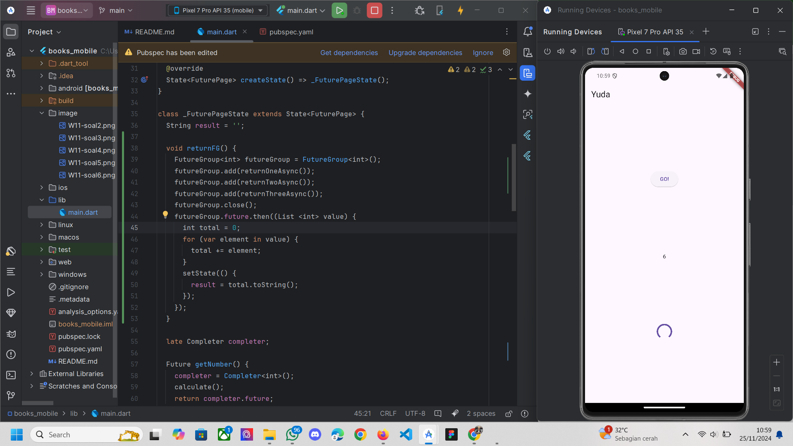
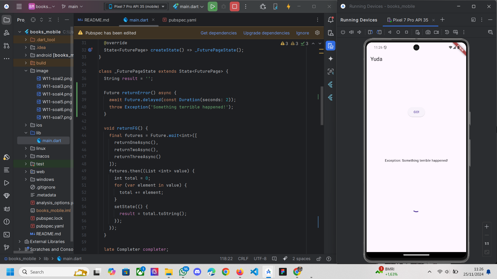
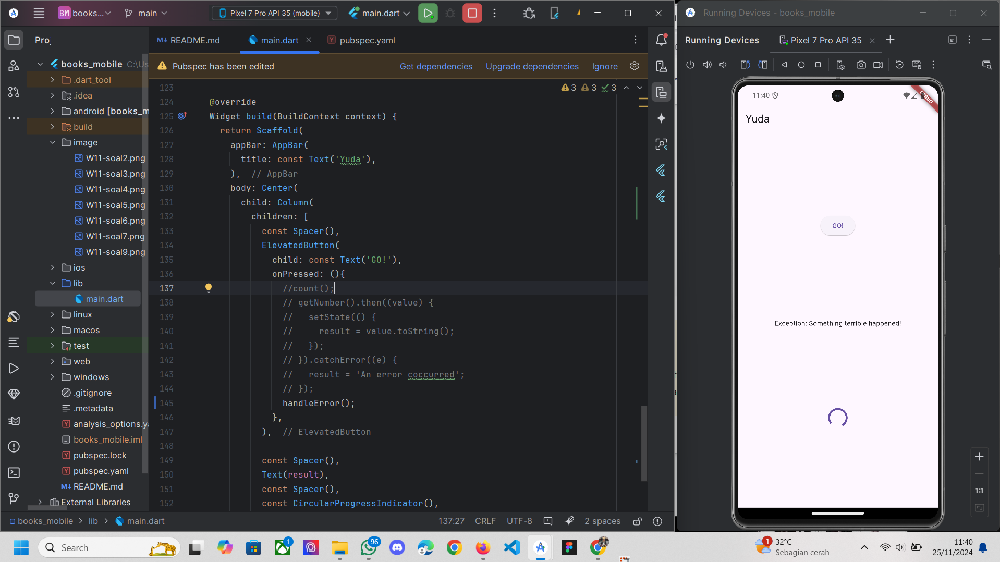
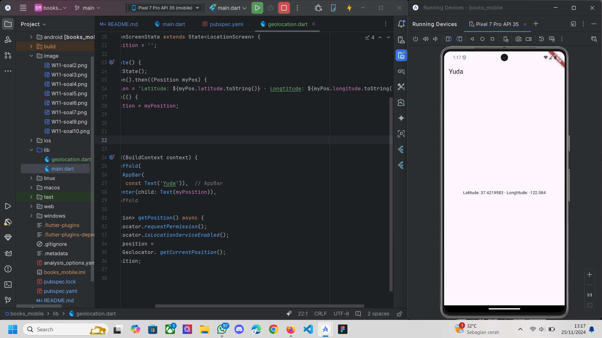
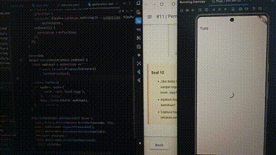
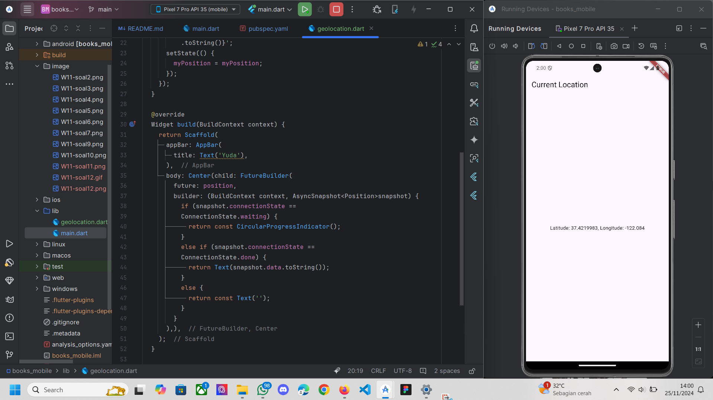

# books_mobile

A new Flutter project.

praktikum 1 hasil dari mengambil data buku dari google books

maksud dari substring mengurangi string dari value.body untuk mengambil 450 karater pertama,
sehingga teks yang di tampilkan bisa di batas hingga 450 teks saja.
sedangkan untuk catchError yaitu untuk menangani kesalahan error yang terjadi selama pemangilan fungsi dari asinkron getData,
jika getData() gagal, blok catchError akan dipanggil.

pada langkah 1, Fungsi returnOneAsync dipanggil secara asinkron, Fungsi ini menunggu selama 3 detik Future.delayed sebelum mengembalikan nilai 1.
kode await digunakan untuk menunggu hingga fungsi selesai dijalankan sebelum melanjutkan ke baris berikutnya.
pada langkah 2, returnTwoAsync dipanggil secara asinkron Sama seperti sebelumnya, fungsi ini menunggu 3 detik Future.delayed sebelum mengembalikan nilai 2.

Completer, objek yang digunakan untuk mengontrol penyelesaian completion Future secara manual. Pada baris sebelumnya,
instance Completer<int> dibuat dan dihubungkan dengan Future melalui properti ompleter.future.
calculate() memulai perhitungan menunggu 5 detik, Setelah 5 detik completer.complete(42) menyelesaikan Future dengan nilai 42.
kemudian kode yang menunggu hasil dari getNumber() akan menerima nilai 42 setelah penyelesaian.

Langkah 2 Implementasi sederhana tanpa penanganan error.
sedangkan Langkah 5 dan 6 Implementasi lebih lengkap dengan penanganan error dan pengelolaan hasil di UI.

setelah memencet tombol GO! langsunng muncul angka 6 setelah 3 detik lebih cepat dari sebelumnya

soal 8
Langkah 1 Menggunakan FutureGroup lebih kompleks dan menawarkan kontrol lebih besar atas pengelolaan beberapa Future,
namun membutuhkan lebih banyak kode dan langkah-langkah tambahan.
Langkah 4 Menggunakan Future.wait lebih sederhana dan langsung, cukup dengan memberikan daftar Future yang ingin diselesaikan, 
membuatnya lebih mudah dipahami dan digunakan dalam kasus sederhana.

output soal 9

output soal 10

Langkah 1 menunjukkan bagaimana cara melemparkan error dalam sebuah fungsi asinkron, 
namun tidak menangani atau mengelola error tersebut karena Fungsi ini hanya berfokus pada pembuatan error.
Langkah 4 memperkenalkan penanganan error yang lebih robust menggunakan try-catch-finally. Fungsi ini tidak hanya menangani error 
yang dilemparkan oleh returnError(), tetapi juga memberikan cara untuk memastikan bahwa bagian tertentu dari kode dijalankan meskipun terjadi error melalui blok finally.

soal 11

soal 12

setelah saya mencoba ke browser masih mendapatkan koordinatnya, karena sebelumnya saya sudah menginstall geolocation terlebih dahulu
sehingga browser bisa mendapatkan koordinat lokasinya

soal 13
tidak ada perbedaan dari yang sebelumnya, perbedaannya cuman di bagian delay di "delayed(const Duration(seconds: 3));"
yang menunjukkan menunggu loading selama 3 detik kemudian baru bisa mendapatkan koordinat lokasinya

soal 14
tampilan masih sama, bedanya cuman menambah snapshot.connectionState untuk menangani ketika terjadi error.

## Getting Started

This project is a starting point for a Flutter application.

A few resources to get you started if this is your first Flutter project:

- [Lab: Write your first Flutter app](https://docs.flutter.dev/get-started/codelab)
- [Cookbook: Useful Flutter samples](https://docs.flutter.dev/cookbook)

For help getting started with Flutter development, view the
[online documentation](https://docs.flutter.dev/), which offers tutorials,
samples, guidance on mobile development, and a full API reference.
